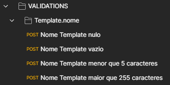

## Projeto para salvar testes de requisição e scripts

---

### Introdução

* Instale o programa Postman [AQUI](https://www.postman.com/downloads/)

---

### Testando requisições

1) no topo a esquerda do postman tem a opção **import**, clique nele e ele abre uma página para fazer upload dos arquivos


2) Importe a **coleção**(conjunto de requisições) e o **ambiente**(onde ficam as variáveis necessárias para as requisições) desejada do diretório **Requisições**


3) No postman vai mostrar quais você está importanto e informações importantes


4) Dentro de toda coleção de requisições tem dois diretórios:
   
    4.1) **CRUD** ficam todas as requisições base da entidade, todas devem estar funcionando
   
    4.2) **VALIDATIONS** ficam as validações dos objetos dentro da entidade.


5) As requisições devem possuir as seguintes nomenclaturas:

```
<Tipo Requisição REST> <Nome Entidade>
```


6) As validações o nome deve ser o que está sendo validado, onde deve possuir uma requisição para casa validação e objeto:



7) O **Ambiente** (Enviroment) ficam as constantes utilizadas no projeto, onde cada conjunto de requisição terá o seu, mesmo que tenham somente a URL de teste

* Sua localização fica a direita bem na ponta


* Quando é testado, na hora que é criado um objeto da entidade, ele vai salvar o ID do objeto criado no banco e esse valor vai ser salvo no ambiente **Global** (globals), onde ficam as variáveis de utilização entre requisições

---

### Testando as requisições

