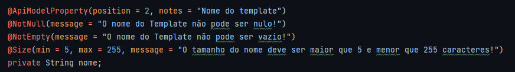

## Repositório de armazenamento

* Neste repositório ficam os seguintes arquivos
  * Collections e Enviroments dos testes de requisição de cada objeto do backend.
  * Scripts de SQL utilizados no projeto.
  * Scripts Linux uteis para toda a equipe e de estudos.

---

## Glossário

| Ordem | Tópico                |
|-------|-----------------------|
| 1     | [Testando Requisições utilizando o Postman](#Testando) |
|2|[Importanto Requisições Existentes](#Importando)|
|3|[Testando as requisições](#requisições)|
|4|[Scripts de SQL](#SQL)|
|5|[Script Linux](#Script)|
---

### Testando Requisições utilizando o Postman

* Instale o programa Postman [AQUI](https://www.postman.com/downloads/)

---

### Importando Requisições Existentes

1) no topo a esquerda do postman tem a opção **import**, clique nele e ele abre uma página para fazer upload dos arquivos


2) Importe a **coleção**(conjunto de requisições) e o **ambiente**(onde ficam as variáveis necessárias para as requisições) desejada do diretório **Requisições**


3) No postman vai mostrar quais você está importanto e informações importantes


4) Dentro de toda coleção de requisições tem dois diretórios:
   
    4.1) **CRUD** ficam todas as requisições base da entidade, todas devem estar funcionando
   
    4.2) **VALIDATIONS** ficam as validações dos objetos dentro da entidade.


5) As requisições devem possuir as seguintes nomenclaturas:

```
<Tipo de Operação no banco> <Nome Entidade>
```
Deve seguir o padrão CRUD


6) As validações o nome deve ser o que está sendo validado, onde deve possuir uma requisição para casa validação e objeto:


7) O **Ambiente** (Enviroment) ficam as constantes utilizadas no projeto, onde cada conjunto de requisição terá o seu, mesmo que tenham somente a URL de teste

* Sua localização fica a direita bem na ponta


* Quando é testado, na hora que é criado um objeto da entidade, ele vai salvar o ID do objeto criado no banco e esse valor vai ser salvo no ambiente **Global** (globals), onde ficam as variáveis de utilização entre requisições

---

### Testando as requisições

| Tipos de Requisição                                                               |
|-----------------------------------------------------------------------------------|
| [POST](#post)                                                                     |
| [GET By ID](#get-by-id)                                                           |
| [PUT](#put)                                                                       |
| [GET ALL](#get-all)                                                               |
| [DELETE](#delete)                                                                 |
| [VALIDATIONS](#validations)                                                       |
| [Rodando todos os testes ao mesmo tempo](#rodando-todos-os-testes-ao-mesmo-tempo) |

* No estilo arquitetural REST, a manipulação dos recursos disponibilizados para o cliente é realizada através de métodos do protocolo HTTP.

#### POST

* É utilizado para [**criar**]() um novo registro no banco de dados.
* Tipo de resultado: **Status Code 201 – registro criado**
* Graças ao POST, podemos fazer uma operação chamada **CREATE** no banco de dados,é uma operação de insert que o Springboot faz por nós no Controller. 
* Nomenclatura dessa Requisição: `Create <Nome do Model>`

1) Na aba **Body** no postman iremos colocar os dados que queremos salvar, dai quando cliado no botão **Send** ele vai enviar os dados para a API e terá como retorno o Status que retornou da API e um JSON no **Response** com os dados salvos


2) Na aba **Tests** os testes são criados em Javascript e devem ser colocados em ordem, assim que o resultado da requisição for 201 ele vai salvar o ID do objeto em uma variável global


#### GET By ID

* É utilizado para [**buscar**]() um registro no banco de dados pelo ID passado na URL
* Tipo de resultado: **Status Code 200 OK**
* Graças ao GET, podemos fazer uma operação chamada **READ** no banco de dados
* Nomenclatura dessa Requisição: `Read <Nome do Model>`

1) Na **URL** da requisição chamamos a variável global que foi gerada com a requisição **POST** ou podemos criar a variável manualmente no **Enviroment**, mas somente se o conjunto de requisições não tem como conseguir esse id.


2) Na aba **Tests** somente tem o teste que o GET deve retornar o código 200, mas podemos ter testes que também salvam um ID específico caso precise. O retorno da requisição é o objeto que demos o ID que está salvo no banco de dados


#### PUT

* É utilizado para [**atualizar**]() um registro no banco de dados pelo ID passado na URL.
* Tipo de resultado: **Status Code 200 OK**
* Graças ao PUT, podemos fazer uma operação chamada **UPDATE** no banco de dados.
* Nomenclatura dessa Requisição: `Update <Nome do Model>`

1) Na **URL** da requisição chamamos a variável global que foi gerada com a requisição **POST** ou podemos criar a variável manualmente no **Enviroment**, mas somente se o conjunto de requisições não tem como conseguir esse id.
2) No **Body** da requisição colocamos quais dados queremos editar do objeto salvo no banco, eles devem ter os mesmos nomes dos objetos salvos, senão vai dar um erro


3) No **Response** (resposta da API) vai mostar um JSON com os dados do objeto que foram salvos no banco, já mostrando a atualização dos dados que você pediu para alterar e os dados das outras variáveis como estão salvar no banco.


4) Na aba **Tests** é feito um tipo diferente de teste, onde além de verificar se o ID é um número ele vai verificar se o ID da resposta é o mesmo ID da variável global criada pelo **POST**, por isso essa variável global não pode ser alterada manualmente, somente pela requisição **POST**.


#### GET ALL

* É utilizado para [**buscar todos**]() os dados do objeto da requisição.
* Tipo de resultado: **Status Code 200 OK**
* Funciona da mesma forma do outro **GET by ID**, onde é feito uma operação chamada **READ** no banco de dados.
* Nomenclatura dessa Requisição: `Read All <Nome do Model>`

1) Deve apresentar no **Response** todos os objetos que estão salvos no banco **do objeto passado na url**.


#### DELETE

* É utilizado para [**deletar por id**] um registro no banco de dados pelo ID passado na URL.
* Tipo de Resultado: **Status Code 200 OK**.
* Graças ao DELETE, podemos fazer uma operação **DELETE** no banco de dados.
* Nomenclatura da Requisição: `Delete <Nome do Model>`

1) Deve apresentar no **Response** o ID do objeto excluido.
2) Nos testes é verificado se o ID da exclusão é o mesmo que o ID salvo na variável global criada pelo **POST**, por isso essa variável global não pode ser alterada manualmente, somente pela requisição **POST**.
3) Após deletado e apresentado o ID e verificado, é limpo todas as variáveis globais.


#### VALIDATIONS

* **VALIDATIONS** é o nome do diretório onde se encontram todas as requisições das [**validações dos dados do objeto**](), cada validação deve ter sua própria requisição.
* Essas requisições servem para testar possíveis erros que podem acontecer na requisição, se um dado não pode ser nulo ou falta alguma informação.
* Eles são rodados como qualquer uma das requisições acima. 

1) Para cada variável ou objeto, deve ter um diretório interno com suas requisições de validação


2) Essas requisições devem dar as mensagens de erros definidos nas validações do DTO



3) Todas as requisições vão dar o tipo de resultado **400 Bad Request** e no **Response** vai ser apresentado a mensagem definida para o tipo de erro


4) Nos testes é somente verificado se realmente foi o status 400 que ocorreu


#### Rodando todos os testes ao mesmo tempo

* No postman podemos rodar todas as requisições na ordem que colocarmos elas.
* Isso ajuda a não ter que rodar uma a uma para testar se tudo está certo.
* Todas as requisições devem estar na seguinte ordem:


* Após estar na ordem correta e seguindo o padrão apresentado em cada uma das requisições do CRUD, iremos selecionar a pasta do CRUD e vai mostrar a seguinte página:


* Ao clicar no botão **Run** na parte de cima dessa página, irá trazer todas as requisições criadas na ordem que estão no diretório, onde o postman irá verificar elas em ordem os testes definidos na aba **Tests**


* São os testes das requisições que importam, onde todos verificam o status que deve retornar da requisição, alguns irão verificar o ID salvo com a variável global(PUT e DELETE) e alguns irão salvar o ID na variável global (POST), por isso que é importante eles estarem em ordem, porque eles vão fazer o seguinte:
  * O POST vai criar o objeto, salvar no banco e pegar o ID e salvar na variável global.
  * O GET vai verificar se o dado está no banco salvo mesmo
  * O PUT vai alterar o dado do banco com um dado passado no body, onde o teste vai verificar se foi feito alteração e se os IDs estão iguais
  * O GET ALL vai trazer todos os dados salvos do banco
  * O DELETE vai deletar um dado, verificar se o ID do dado deletado é igual e apagar as variáveis globais
* Uma requisição utiliza a requisição anterior para fazer algo, estão encadeadas, por isso é importante estar na ordem correta.
* Ele vai mostrar em verde e com a mensagem **Pass** se a requisição passou no teste definido na aba **Tests**
* Para os testes serem validados pelo revisor, **TODAS AS REQUISIÇÕES DEVEM ESTAR PASSANDO NOS TESTES**.


* é muito importante o revisor verificar se passou todos os testes e se no banco foi realmente alterado os valores, por isso o revisor deve testar um a um vendo se estão fazendo o que devia e depois testar todos ao mesmo tempo usando o runner do postman.

---

### Scripts de SQL

* Iremos salvar os Scripts de SQL nesse repositório, junto com os testes de requisições
* Todos os Scripts devem estar comentados o que cada coisa no Script faz:

```sql
----------------------------------------------
-- EXEMPLO DE SCRIPT CRIANDO DADOS NO DATABASE
----------------------------------------------

-- Criando um Schema de exemplo
CREATE SCHEMA IF NOT EXISTS examples;

-- Criando uma tabela dentro desse schema
CREATE TABLE examples.test (
    i_test int,
    nome varchar(255)
);

-- Fazendo um INSERT nessa tabela
INSERT INTO examples.test (i_test, nome)
VALUES (1,'Teste');

-- Buscando dados dessa tabela
select * from examples.test
where i_test = 1;

-- Buscando dados por um ID colocado pelo cliente
select * from examples.test
where i_test = $(id);

-- Buscando data atual (no postgreSQL)
now();
```

* Todos os Scripts devem ter um nome que faça sentido.
* Todos os Scripts devem ser separados para um processo específico (schema, tabela, inserts, etc...).
* Todos os Scripts devem ser salvos no diretório **Scripts_SQL**.

---

### Script Linux

* Caso utilize linux, coloque os Script de auxilio para a equipe no diretório **Script_Linux**
* Devem ser do tipo Shell Script (**.sh**) com os comandos e comentários do que cada um faz.
* Para transformar o arquivo em executável, abra um console e rode o comando abaixo, alterando o `<nomeArquivo>` pelo nome do arquivo

```shell
# Para tornar executável
chmod +x <nomeArquivo>.sh

# Para rodar o Script
./<nomeArquivo>.sh
```

* Exemplo de Arquivo

```shell
#-----------------------------------
# INICIADOR DO INTELLIJ PELO CONSOLE
#-----------------------------------

#Obs: o diretório do intellij deve estar no diretório Download e esse Script no diretório Desktop

# 1) Retorna ao diretório raiz (~/)
cd ..
# 2) Acessa o Diretório Downloads
cd Downloads/
# 3) Acessa o diretório da versão do Intellij
cd idea-IU-222.3739.54/
# 4) Acessa o diretório bin do intellij
cd bin
# 5) Executa o Script de inicialização do Intellij
./idea.sh
```

